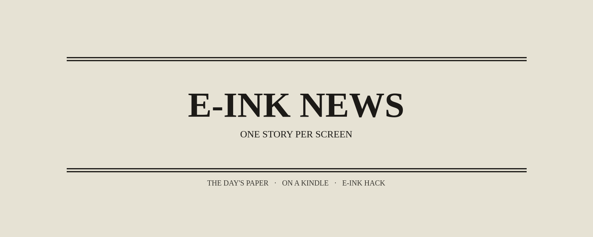

<p align="center">
  
</p>

<h1 align="center">E-INK NEWS</h1>

<p align="center">
  <strong>One story per screen.</strong><br />
  The day's paper, turning itself on a Kindle.
</p>

<p align="center">
  
  
  <a href="LICENSE"></a>
</p>

<p align="center">
  <a href="#on-the-kindle">On the Kindle</a>
  ·
  <a href="#on-your-desk">On your desk</a>
  ·
  <a href="#how-it-stays-fresh">How it stays fresh</a>
  ·
  <a href="#make-it-yours">Make it yours</a>
</p>

---

Open it and walk away. Every eight seconds the page becomes a new front:
masthead, section, headline, picture, two sentences, the feed's own line
underneath.

Tap the **left third** to go back. Tap the **right third** to go forward.
Same gesture as turning a Kindle page. The middle is for the link.

Politics, Europe, Asia, Tech, Finance — the
[World Monitor](https://github.com/koala73/worldmonitor) list, one picture
at a time, on a panel that loves a full-screen repaint.

---

## On the Kindle

Two doors. Same address.

### Experimental browser

Open `http://<this-machine-ip>:8080/` and leave it.

The board turns on its own. A tap on the side turns it by hand. Only the
picture on screen is fetched. Every ten minutes the page reloads for the
next edition.

### KOReader plugin

KOReader cannot draw HTML, so the server photographs each slide and the
plugin shows the pictures.

```sh
cp -r einknews.koplugin /path/to/koreader/plugins/
```

Restart KOReader, then:

1. **Tools → E-INK NEWS: server** — type `http://<this-machine-ip>:8080` once
2. **Tools → E-INK NEWS** — the paper opens

Left / right to turn. Middle tap for the buttons. While it is open it
checks for a new edition every 20 seconds, and pulls pages one at a time
(the radio is slow). Copy the plugin once. After that the Kindle follows
the server by itself.

---

## On your desk

```sh
npm install
npm run news      # stories, pictures, summaries
npm run build     # the static board
npm run render    # photos for the plugin
npm run serve     # http://<this-machine-ip>:8080/
```

Kindle cannot see it? Open the port:

```sh
sudo ufw allow 8080/tcp
```

`npm run build` never goes online. It reads `src/data/news.json`, which
already lives in the repo.

Summaries need an OpenRouter key. Without one the board still builds —
the feed text stands in until the lines catch up.

```sh
export OPENROUTER_API_KEY=sk-or-...      # or drop it in .openrouter-key
```

`.openrouter-key` is git-ignored.

---

## How it stays fresh

A GitHub Action collects the paper every **30 minutes**: feeds, pictures,
a handful of AI summaries, then a commit. Vercel only runs `npm run build`.
It never waits on a model.

Put `OPENROUTER_API_KEY` in the **GitHub** secrets. Vercel does not need it.

At home, for the LAN board and the plugin slides:

```sh
npm run feed        # one round: news + build + render
npm run auto-feed   # the same, every 10 minutes
```

```sh
setsid nohup npm run auto-feed > /tmp/eink-news-feed.log 2>&1 &
```

Host the browser board on Vercel by importing the repo. Photographing
slides for KOReader needs Chromium, so that part stays on a machine you
control.

---

## Make it yours

Every block on the slide has a **fixed place**. A long headline shrinks.
It never shoves the story down. Pictures always fill the same frame.

A story without a picture does not make the board. A story without a
summary yet still does.

The masthead, the tagline and the eight-second turn live in `feeds.json`.
Bylines are fictional and stable — the same headline keeps the same
reporter. Stories link to their source. The Kindle underlines every link,
so the design does not fight it.

```json
{ "name": "Tech", "feeds": [{ "name": "Ars Technica", "url": "https://feeds.arstechnica.com/arstechnica/technology-lab" }] }
```

| Knob | Default | What it does |
| --- | --- | --- |
| `max_slides` | 200 | stories on the board, newest first |
| `require_image` | true | no picture, no slide |
| `items_per_feed` | 2 | cap per feed |
| `summaries_per_run` | 40 | AI lines written in one run |
| `seconds` | 8 | how long a story stays on screen |
| `profiles` | `[[600,800]]` | panel sizes to print |

After importing a new World Monitor list:

```sh
node tools/filter-feeds.mjs        # keep the feeds that ship a picture
```

```sh
npm run check                      # Kindle-safe HTML, one ES5 script
```

```
feeds.json                 the paper: sections, feeds, masthead
src/data/news.json         what the board reads
src/data/summaries.json    so a headline is never asked twice
public/img/news/           pictures for this edition
einknews.koplugin/         KOReader app
docs/banner.png            the masthead above
```

---

MIT. See [LICENSE](LICENSE). The news belongs to the feeds it came from.

A house project of **E-INK HACK**.
