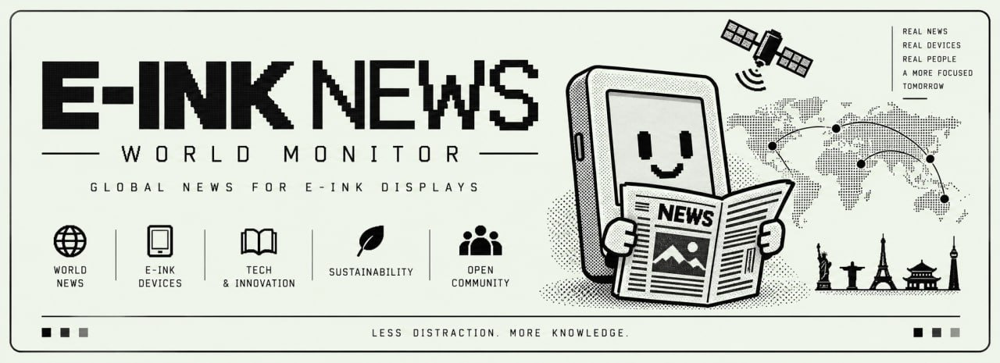

<p align="center">
  
</p>

<h1 align="center">E-INK NEWS</h1>

<p align="center">
  <strong>One story per screen.</strong><br />
  The day's paper, turning itself on a Kindle.
</p>

<p align="center">
  
  
  <a href="LICENSE"></a>
  <a href="https://eink-news-nine.vercel.app/"></a>
</p>

<p align="center">
  <a href="#on-the-kindle">On the Kindle</a>
  ·
  <a href="#on-your-desk">On your desk</a>
  ·
  <a href="#how-it-stays-fresh">How it stays fresh</a>
  ·
  <a href="#make-it-yours">Make it yours</a>
  ·
  <a href="#community">Community</a>
</p>

---

Open it and walk away. Every eight seconds the page becomes a new front:
masthead, section, headline, picture, two sentences, the feed's own line
underneath.

Tap the **left third** to go back. Tap the **right third** to go forward.
Same gesture as turning a Kindle page. The middle is for the link.

Politics, Europe, Asia, Tech, Finance — the
[World Monitor](https://github.com/koala73/worldmonitor) list, one picture
at a time, on a panel that loves a full-screen repaint.

> [!NOTE]
> A house project of **E-INK HACK**. The workshop is on
> [Discord](https://discord.gg/KYChSeuyk) — Kindle, Kobo, any e-ink panel.

---

## On the Kindle

Same paper: [eink-news-nine.vercel.app](https://eink-news-nine.vercel.app/).
Two ways to read it on the panel, plus the live HTML if you want it.

| | **Reader** | **Board** |
| --- | --- | --- |
| What it is | You turn the pages | Walk away; it turns itself |
| Where | KOReader → Tools | Library, as a scriptlet |
| Gesture | Left / right thirds | Tap once to leave |
| Beat | Still until you tap | Every eight seconds |
| Needs | KOReader plugin | `curl` or HTTPS `wget` |

### Reader

KOReader cannot draw HTML, so the server photographs each slide and the
plugin shows the pictures. You turn them like a book.

```sh
cp -r einknews.koplugin /path/to/koreader/plugins/
```

Restart KOReader, then **Tools → E-INK NEWS: reader**.

Left third goes back. Right third goes forward. Middle tap for the
buttons. While it is open it checks for a new edition every 20 seconds
and pulls pages one at a time (the radio is slow).

### Board

The scriptlet paints the same photographs with fbink, full screen, on
the same eight-second beat as the site. Open it from the library and
leave the Kindle on the table.

```sh
cp eink-news.sh /mnt/us/documents/
```

Eject. It shows up as **E-INK NEWS**. Tap once to go back to the library.

The Kindle needs `curl` or a `wget` that speaks HTTPS. The paper lives
on Vercel.

Inside KOReader there is the same mode: **Tools → E-INK NEWS: board**.
The pages turn by themselves; a tap on the side still skips.

To host the paper yourself, set **Tools → E-INK NEWS: server** (no
trailing slash).

### Experimental browser

Open `https://eink-news-nine.vercel.app/` and leave it.

This is the **only** door that draws the live HTML: the timer and the
taps. Every ten minutes the page reloads for the next edition.

---

## On your desk

```sh
npm install
npm run news      # stories, pictures, summaries
npm run build     # the static board
npm run render    # photos for the plugin
npm run serve     # http://<this-machine-ip>:8080/  (local only)
```

Kindle cannot see it? Open the port:

```sh
sudo ufw allow 8080/tcp
```

`npm run build` never goes online. It reads `src/data/news.json`, which
already lives in the repo.

Summaries need an OpenRouter key. Without one the board still builds —
the feed text stands in until the lines catch up.

```sh
export OPENROUTER_API_KEY=sk-or-...      # or drop it in .openrouter-key
```

`.openrouter-key` is git-ignored.

---

## How it stays fresh

A GitHub Action collects the paper every **30 minutes**: feeds, pictures,
a handful of AI summaries, then photographs the slides for the Kindle and
commits the lot. Vercel only runs `npm run build`. It never waits on a
model, and it never needs Chromium — the pictures are already in
`public/kindle/`.

Put `OPENROUTER_API_KEY` in the **GitHub** secrets. Vercel does not need it.

At home, for a local board:

```sh
npm run feed        # one round: news + build + render
npm run auto-feed   # the same, every 10 minutes
```

```sh
setsid nohup npm run auto-feed > /tmp/eink-news-feed.log 2>&1 &
```

Host the browser board on Vercel by importing the repo. The KOReader
plugin talks to that same site.

---

## Make it yours

Every block on the slide has a **fixed place**. A long headline shrinks.
It never shoves the story down. Pictures always fill the same frame.

A story without a picture does not make the board. A story without a
summary yet still does.

The masthead, the tagline and the eight-second turn live in `feeds.json`.
Bylines are fictional and stable — the same headline keeps the same
reporter. Stories link to their source. The Kindle underlines every link,
so the design does not fight it.

```json
{ "name": "Tech", "feeds": [{ "name": "Ars Technica", "url": "https://feeds.arstechnica.com/arstechnica/technology-lab" }] }
```

| Knob | Default | What it does |
| --- | --- | --- |
| `max_slides` | 200 | stories on the board, newest first |
| `require_image` | true | no picture, no slide |
| `items_per_feed` | 2 | cap per feed |
| `summaries_per_run` | 40 | AI lines written in one run |
| `seconds` | 8 | how long a story stays on screen |
| `profiles` | `[[600,800]]` | panel sizes to print |

After importing a new World Monitor list:

```sh
node tools/filter-feeds.mjs        # keep the feeds that ship a picture
```

```sh
npm run check                      # Kindle-safe HTML, one ES5 script
```

```
feeds.json                 the paper: sections, feeds, masthead
src/data/news.json         what the board reads
src/data/summaries.json    so a headline is never asked twice
public/img/news/           pictures for this edition
public/kindle/             photographed slides for the plugin
einknews.koplugin/         KOReader app
eink-news.sh               scriptlet: the paper from the library
docs/banner.jpg            the masthead above
```

---

<h2 align="center">Community</h2>

<p align="center">
  A house project of <strong>E-INK HACK</strong>.<br />
  Kindle, Kobo, or anything with a slow, honest screen — bring the hack.
</p>

<p align="center">
  <a href="https://discord.gg/KYChSeuyk">
    
  </a>
</p>

<p align="center">
  <a href="https://discord.gg/KYChSeuyk"></a>
</p>

<table align="center">
  <tr>
    <td align="center" width="220">
      <a href="https://discord.gg/KYChSeuyk">
        <br />
        <sub>Where the hacks land</sub>
      </a>
    </td>
    <td align="center" width="220">
      <a href="https://github.com/kumanaya/eink-news">
        <br />
        <sub>This paper</sub>
      </a>
    </td>
    <td align="center" width="220">
      <a href="https://x.com/danielkumanaya">
        <br />
        <sub>What we are shipping</sub>
      </a>
    </td>
  </tr>
</table>

> [!TIP]
> Start in the [Discord](https://discord.gg/KYChSeuyk). Drop a photo of the panel, a KOReader plugin, a scriptlet, a dead end. That is the whole point.

---

MIT. See [LICENSE](LICENSE). The news belongs to the feeds it came from.
